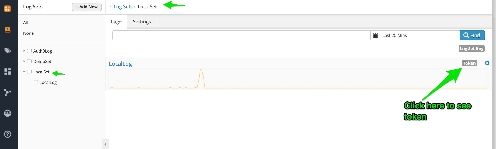
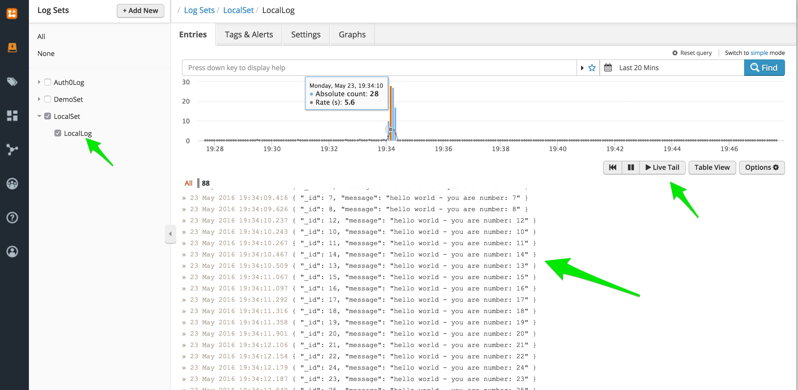

# logs-to-logentries

A client implementation for Logentries in node.js.

## Usage

Very simple.

First of all, set up an account with [Logentries](https://www.logentries.com)

Create a Log which in turn will issue you with a Token.



See docs here for [HTTP POST](http://docs.logentries.com/docs/http-post) too

Now write a few lines of code to call logs-to-logentries:

```js

const Logentries = require('logs-to-logentries');

var logentriesToken = 'YOUR_LOGENTRIES_TOKEN';
// var logentriesToken = '44dabcdef-939b-4caa-829e-e89fghei9316';

// var endpoint = 'YOUR_ENDPOINT';
var endpoint = 'https://webhook.logentries.com/noformat/logs/';

var url = endpoint + logentriesToken;

const logentries = Logentries.createClient({
  url: url
});

var cb = function (err, res) {
  if (err) {
    // handle error
  }
  // handle success
};

// contrived example..

// single log message
var log = {test: "test only"};
logentries.log(JSON.stringify(log), cb);

```

Optionally, setup a live tail to your Log endpoint 

You should see your logs appearing, eg.

Done!


If you are looking for "bulk" extraction of logs to `logentries` then for the timebeing
there is unfortunately a body size restriction on the logentries HTTP Post endpoint:

The maximum number of characters that can be included in the body is 8192, if you exceed this limit then you message will be dropped


To get around this, you could use a library like [async.js](https://github.com/caolan/async) and cycle through in batches of 5 (series) at a time.


Here is some contrived, basic code on how this might work (here we are creating the logs for demo purposes only too):


```
var async = require('async');

const Logentries = require('logs-to-logentries');

var logentriesToken = 'YOUR_LOGENTRIES_TOKEN';
// var logentriesToken = '44dabcdef-939b-4caa-829e-e89fghei9316';

// var endpoint = 'YOUR_ENDPOINT';
var endpoint = 'https://webhook.logentries.com/noformat/logs/';

var url = endpoint + logentriesToken;

const logentries = Logentries.createClient({
  url: url
});

async.waterfall([
  (callback) => {
    var logs = [];
    for(var i = 0; i < 100; i++) {
      logs.push({_id: i, message: 'hello world - you are number: ' + i});
    }
    return callback(null, {logs: logs});
  },
  (context, callback) => {
    callback(null, context);
  },
  (context, callback) => {

    async.eachLimit(context.logs, 5, (log, cb) => {
    
      // logentries here...
      logentries.log(JSON.stringify(log), cb);

    }, (err) => {
      if (err) {
        return callback(err);
      }
      console.log('Upload completed.');
      return callback(null, context);
    });

  }
], function (err, context) {
  if (err) {
    return console.log('Job failed.');
  }
  return console.log('Job completed.');
});

```

You should see your logs appearing, eg.




This NPM module does have `bulk` sending functionality already written but disabled for time-being until logentries support becomes available.